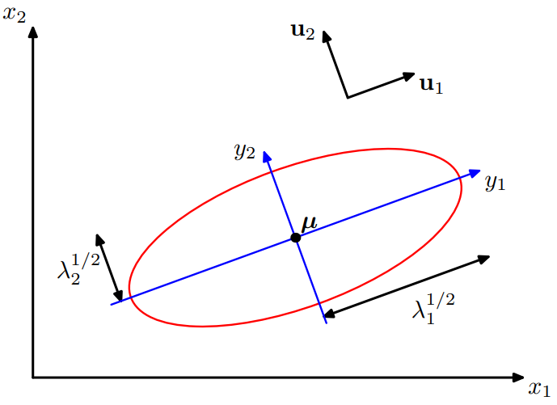
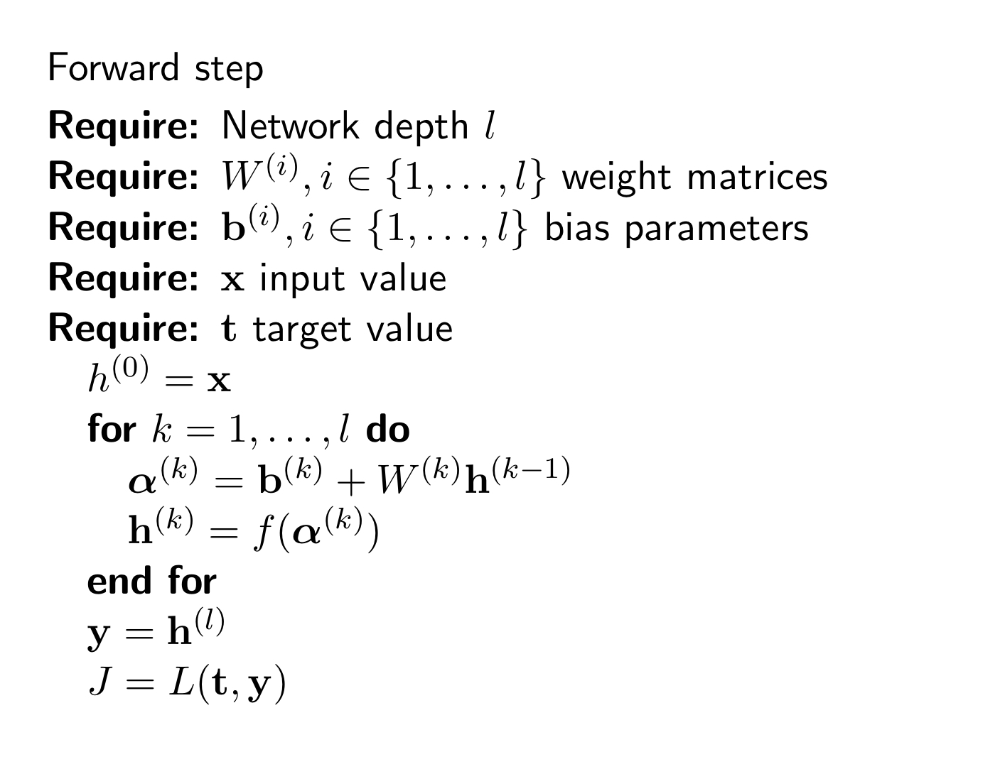
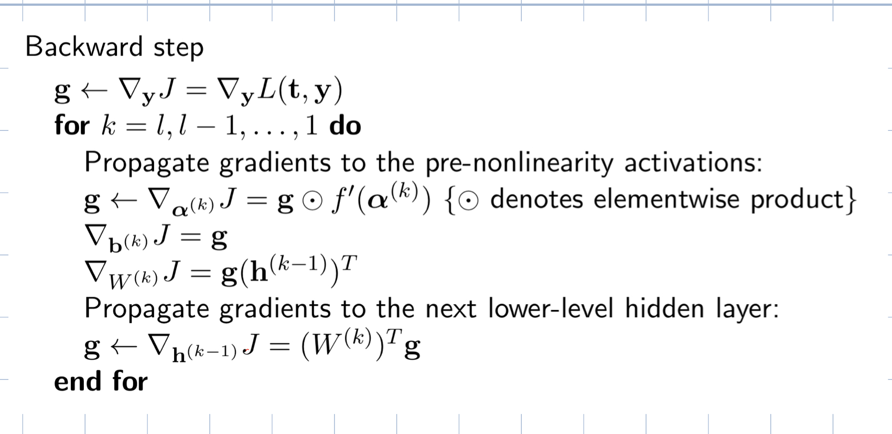
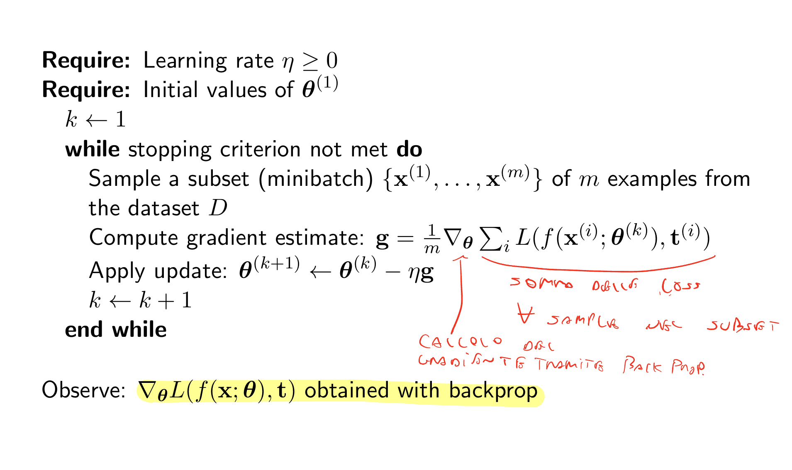

# Machine learning

## Definition of a machine learning problem and its goal

The general Machine Learning problem, we have to approximate a function $f:X \rightarrow Y$, given a dataset $D$ containing informations about $f$.
The specific form of the datasets determines the category of ML problem that we want to solve.

## Probabilistic framework
<!-- https://dsp.stackexchange.com/questions/53128/why-is-random-noise-assumed-to-be-normally-distributed -->
A key thing that we have to keep in mind in the Machine Learning setting is the ineherently presence of noise.
When we try to model its probability distribution, using the Gaussian distribution is often a good choice.
Nontheless even if we model it with great accuracy, we still need to make predictions, thus approaching machine learning from a probabilistic perspective helps us quantify and manipulate uncerntainty directly.

## Supervised Learning

In supervised learning, the dataset $D$ comprises, of pairs of input output

$$D = \{<x,y>|x \in X, y \in Y \}$$

### Sample error

The sample error represents the error that we make on instances present in the training set.

$$ \text{error}_S(h) = \frac{1}{n} \sum_{x \in S} \delta(f(x) \not ={h(x)})$$

### True Error

We assume that different instances of $X$ presented to us in the dataset is drawn from an unknown distribution $\mathcal{D}$.
The true error is the error that the hypotesis make on any value choosen at random from $\mathcal{D}$.

$$ \text{error}_D(h) = P_{x \in D}(f(x) \not ={h(x)})$$

The true error is impossible to compute, but we can estimate it.

### Overfitting

Given a hypotheses space $H$, a hypotheses $h \in H$, is said to overfit the training data if there exists some $h' \in H$, such that:

$$ \text{error}_S(h) < \text{error}_S(h') \cap \text{error}_{\mathcal{D}}(h) > \text{error}_{\mathcal{D}}(h') $$

Overfitting occurs when the hypotesis is too complex compared to the task it tries to solve.

### Overfitting Decision Trees

The depth of a tree controls it's complexity.
A decision tree that perfectly classify training examples could lead to overfitting when there is either noise or/and not enough samples in the dataset.
There are two possible approach this problem

1. Stop growing the tree before it starts to overfit. The decision tree stops generating nodes when there is no good attribute to split on.
2. Grow the full tree and then post prune using a statistical significant test.

The second approach is to be preferred, because in the first is possible that at one given point no particular attribute is the best, but there are a combination that are informative.

### Bayesian learning

The uncertainty is modeled in a bayesian framework.
This means that our beliefs are updated as soon as new data is presented to us.
The bayes theorem is as follows:

$$P(A|B) = \frac{P(B|A)P(A)}{P(D)}$$

$P(A|B)$ is the called posterior, beacuse is the updated belief about $A$ after taking into consideration the evidence, $B$.
$P(B|A)$ is the likelihood and express how well the observed data supports our hypotesis.
$P(A)$ is the prior, reflects the prior beliefs we had before evidence was presented to us.

### Maximum a Posteriori Hypothesis

Is usual that a particular learning algorithm returns not a single hypotesis but a set of hypotesis.
Our objective would be to determine the most probable hypotesis $h$ given the data at hand $D$.
In other word we would like to determine hypotesis that maximizes the posterior.

$$h_{MAP} = \underset{h \in H}{\text{argmax}} P(h | D) \\$$
$$ \stackrel{(1)}{=} \underset{h \in H}{\text{argmax}} \frac{P(D|h)P(h)}{P(D)} \\$$
$$ \stackrel{(2)}{=} \underset{h \in H}{\text{argmax}}  {P(D|h)P(h)}$$

(1) Is given by Bayes Theorem.
(2) Is given by the fact that $P(D)$ is a constant and $\text{argmax}$ is invariant to constant multiplication.

### Maximum Likelihood

Assuming we know the prior probability of each hypotesis $h$, we can determine the most probable hypotesis by computing the $h_{MAP}$.
However the knowledge of $P(h)$, might not be available, thus we have no reason to think that a particular hypotesis must be preferred over another, so we model it as a uniform distribution, thus $P(h)$ can be ignored, because it becomes a constant value.

$$h_{ML} =\underset{h \in H}{\text{argmax}} P(h \mid D) = \argmax P(D\mid h)$$

### Optimal Bayes Classifier

While the $h_{MAP}$ is the most probable hypotesis, given the data, it's classification might not be the most probable.
The Bayes Optimal Classifier on the other hand classify each instance with its most probable value.
The BOC, determines the most probable value by making a weighted sum of the probability of a specific value $v$, assuming that $h$ is true, weighted by the probability of $h$ being true given the data $D$.  

$$ v_{obc} = \underset{h \in H}{\text{argmax}} \sum_{hi \in H} P(v | h)P(h | D)$$

The BOC, takes it's name from the fact that under the same hypotesis space, and with the same a priori knowledge no other method outperforms it on average.
It is, however, not practical in real situations, due to its computationally intensive nature.

### Naive Bayes classifier

The Naive Bayes Classifier is a practical algorithm.
It can be used under the assumption that any value $v \in V$, where $V$ is a finite set, that we want to compute, can be expressed as a conjunction of its attributes.
Since every value can be described as a conjunction of its attributes, the naive Bayes algorithm determines $v_{map}$ in the following way:

$$ v_{MAP} = \underset{h \in H}{\text{argmax}}  P(v | a_1, a_2, .... , a_n) \\$$

$$ \stackrel{(1)}{=} \underset{h \in H}{\text{argmax}} P( a_1, a_2, .... , a_n | v) \\$$
$$ \stackrel{(2)}{=} \underset{h \in H}{\text{argmax}} P(v) \prod_i P(a_i | v) \\$$

(1) Comes from the combined application of Bayes Theorem and that $P(a_1 , \ldots , a_n)$ is a constant.
(2) Comes from the Independence assumption. The independence assumptions states that attributes values are conditionally independent given the target value.

### Naive Bayes as approximation of the OBC

Naive Bayes is considered an approximation of the Bayes optimal classifier because it simplifies the joint probability calculation by assuming conditional independence between features given the class.
While this assumption may not hold in every case, Naive Bayes remains a practical and effective classification algorithm, providing a computationally efficient way to approach the optimal Bayes classifier in situations where the independence assumption is reasonable.

### Document classification

$$ \text{doc}_{i} = \{abstract \cup title \cup author \cup pubblication \}$$

We can now set up a dataset vocabulary.

So given a new doc doc_i we want to compute:

$$ \text{V}_{NB} = \argmax P(cj \mid D) \prod_{i=1}^{n} P(ai \mid cj, D)$$
$$ = \argmax P(cj \mid D) P(d \mid cj, D)$$

We use an approaching bag of words (BoW) based on a multinomial distribution for multiclass problem.

We represent a doc as a fixed-lenght feature vector d given that we have

$$ d = <d1, ..., dn>$$

where d_i = k if word i occurs k time in doc_i

So for each feature we compute:

$$ P(d|c_j, D) = \frac{n!}{d_1! \dots d_n!} \prod_{i=1}^{n} P(w_i|c_j, D)^{d_i} $$

Maximum-likelihood solution:

$$ \hat{P}(w_i|c_j, D) = \frac{\sum_{\text{doc} \in D} tf_{i,j} + \alpha}{\sum_{\text{doc} \in D} tf_j + \alpha \cdot |V|} $$

dove:

1. $$  \text{tf}_{i,j} : \text{numero di occorrenze di \( w_i \) nel documento doc della classe \( c_j \)}.$$
2. $$  \text{tf}_{j} : \text{frequenza di tutti i termini del documento \( \text{doc} \) della classe \( c_j \)}.$$
3. $$  \alpha\text{: parametro di smoothing}.$$

### Linear Regression

Given:

$$ y(x,\bold{w}) = w_0 + w_1x_1 + ... + w_dx_d = \bold{w}^Tx$$

Due to noise, we can say that:

$$ t = y(x,\bold{w}) + \epsilon$$

The optimal value of $\bold{w}$ can be determined using a maximum likelihood approach.
Assuming $\epsilon$ is Gaussian error, and that observations are i.i.d we can define the likelihood function of $\bold{t}$ as:

$$ P( \bold{t} \mid \bold{x}, \bold{w}, \beta) = \prod_{i=1}^{n} N(t_i\mid y(x_i,\bold{w}), \beta^{-1})$$

Insted of maximizing this quantity we can maximize the log likelihood:

$$ \underset{\bold{w}}{\text{argmax}}( \log( P( \bold{t} \mid \bold{x}, w, \beta)))  \\$$
$$= \underset{\bold{w}}{\text{argmax}} (\frac{N}{2} \log {\beta} - \frac{N}{2}\log (2\pi) - \beta E_D(\bold{w}))$$

$$ \stackrel{(1)}{=} \underset{\bold{w}}{\text{argmax}} (E_D(\bold{w}))$$
$$ \stackrel{(2)}{=} \underset{\bold{w}}{\text{argmin}} (E_D(\bold{w}))$$

(1) Comes from the fact that argmax is invariant to constant addition and multiplication.
(2) Come from the fact that maximization of the log likelihood is equivalent to the minimization of negative log likelihood.
Where

$$ E_d(\bold{w}) = \frac{1}{2} \sum_{i=1}^{N} ({t_i - \bold{w}^Tx_i})^2$$

In order to find the minimum we need to differentiate:

$$ \nabla E_d(\bold{w}) = \sum_{i=1}^{N} (t_i - \bold{w}^T x_i)x_i^T$$

setting to zero:

$$ 0 = \sum_{i=1}^{N} t_ix_i^T - \bold{w}^T (\sum_{i=1}^{N}{x_{i}x_{i}^T})$$

Gives us the maximum likely solution, which can be written in closed form.

$$\bold{w}_{ML} = (\bold{X}^T\bold{X})^{-1} \bold{X}^T \bold{t} $$

Determining the optimal values using the closed form can be costly, due to the fact that, it needs to process the entire dataset.
We can define an iterative approach, by updating the weights based on a subset (mini batch) or only a single element (sequential) through the following learning rule.

$$ \bold{w} ^{\tau} \leftarrow \bold{w}^{\tau - 1} - \eta \nabla{E_n}$$

Where $E_n$ is the error averaged over the subset.

### Logistic Regression

Utilizing as a functional form, the GLM we can model the class conditional probbailities and our model as follow:

$$ P(C_1 \mid \bold{x}) = y(\bold{x}) = \sigma(\bold{w}^T\bold{x})$$
$$ P(C_2 \mid \bold{x}) = 1 - P(C_1 \mid \bold{x})$$

we can express the likelihood as

$$ P(\bold{t} \mid \bold{w}) = \prod_{n=1}^{N} y(\bold{x}_n)^{t_n}(1-y(\bold{x}_n))^{1-t_n}$$

Since the logarithm is a non monotonic function, we can use the maximum likelihood approach and determine the optimal values by choosing $\bold{w}^*$ as the $\bold{w}$ that maximizes the log likelihood.
Also since maximizing a function is the same thing as minimizing negative:

$$- \underset{\bold{w}}{\text{argmin}} (\ln P(\bold{t} \mid \bold{w})) = -\sum_{n = 1}^{N} [t_n \ln y(\bold{x}_n) + (1-t_n)\ln (1-y(\bold{x}_n))] = E(\bold{w})$$

Which is the negative cross entropy.

### Gram Matrix

A Gram Matrix is an $N \times N$ symmetric matrix with elements:

$$ Knm = x_{n}^Tx_{m} = K(xn,xm)$$
$$
K = \begin{bmatrix}
    K(x_1, x_1) & K(x_1, x_2) & \cdots & K(x_1, x_n) \\
    K(x_2, x_1) & K(x_2, x_2) & \cdots & K(x_2, x_n) \\
    \vdots  & \vdots  & \ddots & \vdots  \\
    K(x_n, x_1) & K(x_n, x_2) & \cdots & K(x_n, x_n)
\end{bmatrix}
$$
The entries of the Gram matrix correspond to the pairwise similarities between data points, and this matrix is employed to compute decision boundaries in the transformed feature space.

### Definition of kernel

$k$ is a kernel function defined as a real-valued function, simmetric and non negative. $k(x,x')$ with $x,x' \in X$ defines  similarity measure between instances $x$ and $x'$.

### Kernel Trick

If an input vector $\bold{x}$, appers in an algorithm only as an inner product $x^Tx'$, then the inner product can be replaced with some kernel function $k(x,x')$

### Determination of kernelized version for linear regression without regularization

Given a linear model

$$ y(x,\bold{w}) = w_0 + w_1x_1 + ... + w_dx_d = \bold{w}^Tx$$

We know, by using the maximum likely approach that a suitable error function, is the least square error

$$E_d(\bold{w}) = \frac{1}{2} \sum_{i=1}^{N} ({t_i - \bold{w}^Tx_i})^2$$

By setting it to $0$ we get the closed form of $\bold{w}^*$:

$$\bold{w}^* = (\bold{X}{\bold{X}^T})^{-1}\bold{X}^T\bold{t} = \alpha \bold{X}^T = \sum_{n=1}^{N} \alpha_nx_n $$

Were $\alpha$ is defined as $\bold{K}^{-1}\bold{t}$ and $\bold{K}$ is the Gram matrix.
Putting $\bold{w}^*$ back into the model we obtain:

$$ y(x,\bold{w}^*) = \bold{w}^{*^T}x = (\alpha\bold{X})^{T}  x  = \sum_{n=1}^N \alpha_nx_n^Tx $$

By using the kernel trick:

$$ y(x,\bold{w}^*) =  \sum_{n=1}^N \alpha_nk(x_n,x) $$

### Determination of kernelized version for linear regression with regularization

Given a linear model

$$ y(x,\bold{w}) = w_0 + w_1x_1 + ... + w_dx_d = \bold{w}^Tx$$

We know, by using the maximum likely approach that a suitable error function, is the least square error

$$E_d(\bold{w}) = \frac{1}{2} \sum_{i=1}^{N} ({t_i - \bold{w}^Tx_i})^2 + \lambda ||\bold{w}||^2$$

Where $\lambda$ is a regularization term that controls the model complexity.
By setting it to $0$ we get the closed form of $\bold{w}^*$:

$$\bold{w}^* = (\bold{X}{\bold{X}^T} +\lambda \bold{I_n})^{-1}\bold{X}^T\bold{t} = \alpha \bold{X}^T = \sum_{n=1}^{N} \alpha_nx_n $$

Were $\bold{\alpha}$ is defined as $(\bold{K}+\lambda \bold{I_n})^{-1}\bold{t}$ and $\bold{K}$ is the Gram matrix.
Putting $\bold{w}^*$ back into the model we obtain:

$$ y(x,\bold{w}^*) = \bold{w}^{*^T}x = (\alpha\bold{X})^{T}  x  = \sum_{n=1}^N \alpha_nx_n^Tx $$

By using the kernel trick:

$$ y(x,\bold{w}^*) =  \sum_{n=1}^N \alpha_nk(x_n,x) $$

### Generative vs Discriminant Model

In a probabilistic framework the joint probability $P(\bold{x}\bold{t})$ gives us the most complete information.
However determining it directly is often an unfeasible task.
We can then use two different approaches.
A generative approach aims to understand how data is generated, it does so by learning the class conditional densities of each class $P(x\mid C_k)$, the prior $P(C_k)$, and then determining the posterior $P(C_k \mid \bold{x})$.

A discriminative approach are interessed in determining the decision boundary. This can be done in a probabilistic way, for example linear regression uses the form of the class conditional probability $P(C_k \mid x)$ of the Generalized linear models and find the best parameters by using a maximum likelihood approach. Another approach is to directly determine de decision boundary without manipulating explicitly probabilities.

### Perceptron

The perceptron is a simple binary classification algorithm, designed to mimic the way a biological neuron works.
The model coreresponds to a linear combination of the inputs, that are then passed to a function $o$
$$y(\bold{x},\bold{w}) = o(\bold{w}^T\bold{x}) $$

The $o$ function is just the sign function

$$
o(\mathbf{x}) =\text{sign}(\mathbf{w}^T\mathbf{x})=
\begin{cases}
1 & \text{if } \mathbf{w}^T\mathbf{x} > 0 \\
-1 & \text{otherwise}
\end{cases}
$$

This function however is piecewise and thus not differentiable, this means that in order to find the optimal values of $\bold{w}$ we need to define an alternative method, called perceptron critetion.
The output of the sign function is either $-1$ or $1$, thus a condition that must be satisfied is $\bold{w}^T\bold{x}_i\bold{t}_i > 0$. The perceptron criterion aissngs $0$ to any pattern correctly classifiedand tris to minimize the following error function:

$$E(\bold{w})= - \sum_{n \in \mathcal{M}} \bold{w}\bold{x}_n \bold{t}_n$$

where $\mathcal{M}$ is the set of misclassified examples.
It optimizes $E(\bold{w})$ using SGD.
According to the perceptron convergence theorem we know that if the data is linearly separable and the learning rate $\eta$ is chosen corretly the algorithm is guaranteed to finda solution in a finite amount of steps, this however does not guarantees that the time is acceptable.
The initial set of weights is choosen at random, meaning that at the beginning we are most certainly in a bad situation, however if we choose a learning rate small enough we are guaranteed to improve our situation.
The problem is that in a linearly separable dataset, there may exist an infinite number of solutions, and since the movement is slow, due to the learning rate is probable that we get a decision boundary near the data points, leading to a decision boundary with poor generalization performances.

### K-NN

KNN is a non parametric model that uses an instance based approach.
In KNN the instances of the dataset are the parameters, thus KNN has a variable number of parameters, this mean that there is no training phase, but also that it requires a lot of memory because to make a prediction we need the entire subset.
Given a new instance $\bold{x}$, a value $k$ and a distance metric the classification value is chosen as follow:

- Find K-Nearest neighbors of $\bold{x}$, according to the distance metric
- Assign to $x$ the most common class among the k-nearest neighbors

### SVM

The Support Vector Machines makes classification using the maximum margin.
The margin is the distance between the decision boundary and its closest point.
The maximum margin approach can be motivated as follow.
Even if the dataset is linearly separable, there may exist many solutions, since our goal is not to determine a decision boundary but rather to determine the decision boundary that generalizes better. Since the magin is maximum we can achieve a lowe generalization error, beaause we have "more room" for error. The fact that the maximum margin yields a lowe generalization error also means that SVM are less prone to overfitting.

### Kernelized SVM

Given the maximum margin hyper plane, classification new instance $\bold{x}'$ is performed using by

$$y(\bold{x}') = \text{sign}( w_0^* + \sum_{k, x_k\in SV} a_k^*t_{k} \bold{x}'^T \bold{x}_k )$$

But since the input vector, is present only as inner product we can the condition to use the kernel trick is met and we can rewrite as

$$y(\bold{x}') = \text{sign}( w_0^* + \sum_{k, x_k\in SV} a_k^*t_{k} k(\bold{x}'^T, \bold{x}_k) )$$

### Soft margins

If the dataset is not perfectly linearly separable, class conditional distributions may overlap and SVM will result in poor generalization.
We can relax the SVM, allowing to make some classifications.
It is intuitive to understand that, misclassified points are points that are on the wrong side of the decision boundary. Another intuitive thing is that the farther from the decision boundary the point is, the worst its classification.
We formalize this concept through the we introduction of slack variables $\xi$.
Slack variables mark a penalty that increases as the distance from the decision boundary grows.

### SVM for regression

Whe can use SVM for regression.
In machine learning, and more specifically in supervised regression problems, we know we have to deal with noise.
Thus if we make a model we know that is possible that the error we make is non zero.
We express this concept utilizing the following error function:

$$J(w, C) = C \sum_{i=1}^{N} L_{\epsilon}(t_i, y_i) + \frac{1}{2} \| w \|^2$$

In which the term $L_{\epsilon}$ is called $\epsilon$-insensitive error function:

$$
L_{\epsilon}(t, y) =
\begin{cases}
0 & \text{se } |t-y|<\epsilon \\
|t-y|-\epsilon & \text{else}
\end{cases}
$$

The result of using the $\epsilon$-insensitive error is that there is an immaginary tube, called $\epsilon$-tube in which the predictions are assumed correct.
The problem is that $\epsilon$-insensitive error function is piecewise linear and thus not differentiable.
We can solve this problem by introducing two slack variables $\xi$ and $\hat{\xi}$ which represents how much we sthrive from the $\epsilon$-tube.
Constraining $\xi \geq 0$ and $\hat{\xi}\geq 0$ we can reexpress the oerror function as

$$J(w, C) = C \sum_{i=1}^{N} (\xi_n+ \hat{\xi}_n) + \frac{1}{2} \| w \|^2$$

Which can be minimized

## Unsupervised learning

### Expectation Maximization

The EM algorithm is used to find maximum likelihood parameters of a statistical model in cases where the equations cannot be solved directly.
Typically these models involve latent variables in addition to unknown parameters and known data observations.
That is, either missing values exist among the data, or the model can be formulated more simply by assuming the existence of further unobserved data points.
For example, a mixture model can be described more simply by assuming that each observed data point has a corresponding unobserved data point, or latent variable, specifying the mixture component to which each data point belongs.
In its most basic form the EM algorithm works as follows:

- Initialize the parameters that need to be maximized
- Until termination:
  E. Estimate the missing variables in the dataset
  M. Maximize the parameters of the model in the presence of the data

### Gaussian Mixture Model

The Gaussian distribution is a versatile distribution, however being unimodal (has one maximum) it may not be a good fit for specific problems.
We can extend the Gaussian distribution with the concept of mixture distribution or more specifically Gaussian Mixture Models.
We can define a GMM as a linear superposition of $K$ Gaussian

$$ P(\bold{x}) = \sum_{k=1}^{K} \pi_{k}\mathcal{N}(x \mid \mu_{k}, \Sigma_{k})$$

Where $\pi_k$ is called mixing coeffient and can be thought of the prior probability of picking the point from the $k$-th Gaussian.
And $\mu_k$ and $\Sigma_k$ are the mean and covariance for the $k$-th Gaussian.

The form of the GM distribution  is governed by the parameters, one way to set them is through the maximum likelihood approach, however due to the summation of gaussians is not possible to write a solution in closed form and the solution is determined through the EM algorithm.

When visualizing this parameters it might be useful to remember that the variance of a gaussian $\Sigma$ can be expressed in its $D$ components as follow:

$$\Sigma = \sum_i=1^D \lambda_i\bold{u}_i\bold{u}_i^T$$

Where $\lambda_i$ are the eigen values of $\Sigma$

<!-- Check point -->

### Mathematical formulation of K-Means

1. Set a K Value
2. Take K single clusters and assigns N-K samples to them based on distance between centroids and point. After each assignment recompute the centroid
3. Take each sample and compute its distance from the centroid of the clusters, if the samples it is not in the centroid closest clusters switch it. Recompute the centroid
4. Repeat 3 until convergence

### PCA

### Principali Usi

1. Dimensionality reduction
2. data compression
3. Data visualization
4. Feature Extraction

### Express the points in M

$$ \overline{x}_{n} = \sum_{i=1}^{n} (x_{n}^T u_{i})u_{i}$$

### Intrinsic dimension

Minimum dimension to represent the dataset.

### Goal: Maximize data variance after projection to some direction u1

Projected Points:
$x_{n}^Tu1$

Anzitutto fissiamo $\overline{x}$ come la media del nostro dataset, centriamo dunque il dataset sulla nostra media in maniera tale che esso abbiamo media 0.
A questo punto passiamo alla fase di massimizzazione della varianza calcolando la varianza come:

$$ \frac{1}{N} \sum_{n=1}^N [u_{1}^Tx_{n} - u_{1}^T\overline{x}]^2 = u_1^TSu_1$$

Il problema da risolvere diventa:

$$\max u_1^TSu_1$$

Da cui massimizzando e settando la derivata rispetto ad u1 a 0:

$$Su_1 = \lambda u_1$$
$$u_1^TSu_1 = \lambda_1$$

Chiamata first principal component.

S = matrice di Covarianza

## Neural Networks

### Backpropagation

Forward step

()

Backward step

### SGD

# CNN

$$w_{out} = \frac{w_{in} - w_{k} + 2p}{s}+1 $$
$$h_{out} = \frac{h{in} - h_{k} + 2p}{s}+1 $$
$$ \mid \theta \mid = w_{k} \times h_{k} \times d_{in} \times d_{out} + d_{out} $$

Padding necessario:
$$ \left\lfloor \frac{wk}{2} \right\rfloor $$

# ANN

## Cost function

Model implicitly defines a conditional distribution $( p(t \mid x, \theta) )$

Cost function: Maximum likelihood principle (cross-entropy)

$$ J(\theta) = \mathbb{E}_{x,t \sim D} [-\ln(p(t \mid x, \theta))] $$

Example:
Assuming additive Gaussian noise we have

$$ p(t \mid x, \theta) = \mathcal{N}(t \mid f(x; \theta), \beta^{-1}I) $$

and hence

$$ J(\theta) = \mathbb{E}_{x,t \sim D} \left[ \frac{1}{2} \ \mid  t - f(x; \theta) \ \mid ^2 \right] $$

Maximum likelihood estimation with Gaussian noise corresponds to mean squared error minimization.

## Output units activation functions

### Regression

Linear units: Identity activation function
$$ y = W^T h + b $$

Use a Gaussian distribution noise model
$$ p(t \mid x) = \mathcal{N}(t \mid y, \beta^{-1}) $$

Loss function: maximum likelihood (cross-entropy) that is equivalent to minimizing mean squared error.

Note: linear units do not saturate.

### Binary classification

Output units: Sigmoid activation function
$$ y = \sigma(W^T h + b) $$

Loss function: Binary cross-entropy
$$ J(\theta) = \mathbb{E}_{x,t\sim D} [- \ln p(t \mid x)] $$

The likelihood corresponds to a Bernoulli distribution

Output unit saturates only when it gives the correct answer.

### Multi-class classification

Output units: Softmax activation functions
$$ y_i = \text{softmax}(\alpha^{(i)}) = \frac{\exp(\alpha^{(i)})}{\sum_j \exp(\alpha_j)} $$

Loss function: Categorical cross-entropy
$$ J_i(\theta) = \mathbb{E}_{x,t \sim D} [- \ln \text{softmax}(\alpha^{(i)})] $$

with $( \alpha^{(i)} = w_i^T h + b_i )$.

Likelihood corresponds to a Multinomial distribution

Output units saturate only when there are minimal errors.

### Autoencoder

What is an autoencoder?

1. A combination of two NN, an encoder and a decoder.
2. trained based on reconstruction loss
3. provides low dimensional representation
4. Bottleneck concept, which learn to reconstruct input minimizing a loss function
5. Autoencoders can be seen as a method for non-linear principal component analysis

# Ensemble

## AdaBoost

Given $( D = \{ (x_1, t_1), \ldots, (x_N, t_N) \} ), where ( x_n \in X, t_n \in { -1, +1 } )$

1. Initialize $( w_n^{(1)} = \frac{1}{N}, n = 1, \ldots, N. )$
2. For $( m = 1, \ldots, M )$:

   - Train a weak learner $( y_m(x) )$ by minimizing the weighted error function:
     $$
     J_m = \sum_{n=1}^{N} w_n^{(m)} I(y_m(x_n) \neq t_n),
     $$
     $I(e) = \begin{cases}
     1 & \text{if } e \text{ is true} \\
     0 & \text{otherwise}
     \end{cases}$

   - Evaluate:
     $$
     \epsilon_m = \frac{\sum_{n=1}^{N} w_n^{(m)} I(y_m(x_n) \neq t_n)}{\sum_{n=1}^{N} w_n^{(m)}}
     $$
     and
     $$
     \alpha_m = \ln \left( \frac{1 - \epsilon_m}{\epsilon_m} \right)
     $$

   - Update the data weighting coefficients:
     $$
     w_n^{(m+1)} = w_n^{(m)} \exp[\alpha_m I(y_m(x_n) \neq t_n)]
     $$
